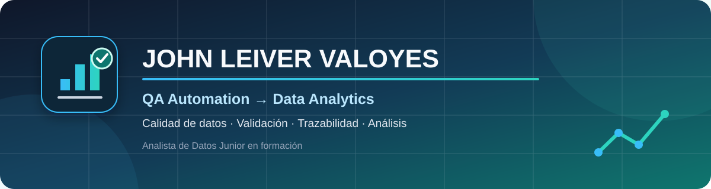

<div align="center">
  
</div>

<div align="center">

### Analista de Datos Junior en formación · QA Automation · Calidad y validación de datos

[](https://www.linkedin.com/in/john-leiver-valoyes)


</div>

## Perfil profesional

Soy profesional de **QA y automatización de pruebas** con más de dos años de experiencia en proyectos empresariales para **Huawei** y **Bancolombia**. Actualmente realizo un **bootcamp de análisis de datos** para orientar mi trayectoria hacia un rol de Analista de Datos Junior.

Mi experiencia laboral todavía no ha sido como analista de datos. Mi diferencial está en trasladar al análisis el rigor desarrollado en QA: interpretar requerimientos, validar resultados, detectar inconsistencias, investigar causas, documentar evidencias y comunicar hallazgos con precisión.

Actualmente fortalezco estas capacidades mediante formación práctica en **Python, SQL, bases de datos, preparación de información, análisis exploratorio y visualización de datos**.

> **Objetivo profesional:** aportar mi experiencia en calidad y automatización para construir análisis confiables, trazables y útiles para la toma de decisiones.

## De QA a Data Analytics

| Experiencia desarrollada en QA | Valor transferible al análisis de datos |
|---|---|
| Validación frente a criterios de aceptación | Comprobar reglas, consistencia y calidad de la información |
| Investigación y seguimiento de defectos | Detectar anomalías, estudiar causas y verificar correcciones |
| Elaboración de evidencias y reportes | Comunicar resultados de manera clara, verificable y trazable |
| Automatización de escenarios repetitivos | Diseñar procesos reproducibles y reducir trabajo manual |
| Trabajo con desarrollo y Product Owner | Comprender necesidades técnicas y preguntas de negocio |
| Atención al detalle en entornos productivos | Reducir errores antes de presentar resultados o conclusiones |

## Data Analytics — formación actual

```text
Datos
  ↓
Revisión de estructura y calidad
  ↓
Limpieza y transformación
  ↓
Consulta y análisis
  ↓
Visualización
  ↓
Hallazgos y recomendaciones
```

Estoy desarrollando competencias para:

- Consultar y organizar información con **SQL**.
- Comprender estructuras relacionales y trabajar con **MySQL**.
- Preparar, limpiar y validar conjuntos de datos.
- Realizar análisis exploratorio con **Python**.
- Identificar patrones, tendencias, valores faltantes e inconsistencias.
- Construir visualizaciones y comunicar conclusiones con contexto.
- Documentar procesos para que los análisis sean reproducibles.

Estas competencias corresponden a mi formación y a proyectos de aprendizaje; no las presento como experiencia laboral previa en Data Analytics.

## Tecnologías y herramientas

### Análisis de datos — en formación


### QA y automatización — experiencia profesional


### Desarrollo y colaboración


## Experiencia profesional

### QA Automation · Adecco Servicios Colombia S.A. / Huawei

`noviembre de 2024 - actualidad`

- Ejecución de pruebas funcionales, smoke y regresión en entornos productivos.
- Automatización de escenarios con Java, Serenity BDD y Cucumber.
- Registro, seguimiento y validación de incidencias mediante Jira.
- Validación de errores antes de su escalamiento al equipo de desarrollo.
- Elaboración de evidencias y reportes de calidad posteriores a despliegues.
- Trabajo colaborativo con desarrollo y Product Owner bajo Scrum.

**Competencias transferibles a datos:** validación sistemática, automatización, documentación de resultados y comunicación de hallazgos técnicos.

### QA Tester · Línea Comunicaciones S.A.S. / Bancolombia

`marzo de 2022 - octubre de 2024`

- Pruebas funcionales sobre aplicaciones internas.
- Validación de flujos de usuario y criterios de aceptación.
- Pruebas de regresión posteriores a correcciones.
- Documentación de casos de prueba y evidencias.
- Reporte y seguimiento de defectos hasta su cierre.

**Competencias transferibles a datos:** comprensión de requerimientos, evaluación de consistencia, atención al detalle y trazabilidad de problemas.

## Portafolio de análisis de datos

Los proyectos del bootcamp se publicarán cuando cuenten con código, datos permitidos, validaciones, resultados y conclusiones reproducibles.

| Proyecto en construcción | Enfoque | Evidencia que incluirá | Estado |
|---|---|---|---|
| Calidad y exploración de datos | Nulos, duplicados, tipos, rangos y patrones | Notebook, controles, gráficos y conclusiones | 🚧 En desarrollo |
| Consultas SQL | Preguntas de negocio sobre una base relacional | Modelo, consultas comentadas y resultados | 🚧 En desarrollo |
| Análisis y visualización | Indicadores, tendencias y comunicación | Proceso, visualizaciones y recomendaciones | 🚧 En desarrollo |

### Estándar de documentación para cada proyecto

1. Problema y objetivo.
2. Fuente, alcance y limitaciones de los datos.
3. Limpieza y controles de calidad.
4. Consultas o transformaciones.
5. Visualizaciones y hallazgos.
6. Conclusiones, recomendaciones y próximos pasos.

## Formación

- **Bootcamp de Análisis de Datos** — en curso.
- **Ingeniería Electrónica**, Universidad Nacional Abierta y a Distancia (UNAD) — últimos semestres.
- **Técnico en Redes de Computadoras**, Servicio Nacional de Aprendizaje (SENA) — culminado.

## Certificaciones

- Testing de Calidad de Desarrollo de Software QA.
- Programación Orientada a Objetos en Java.
- Probador de penetración y piratería ética certificado.

## Actualmente

- Fortaleciendo Python y SQL para análisis de datos.
- Construyendo proyectos reproducibles para este portafolio.
- Aplicando principios de calidad, validación y trazabilidad al trabajo con datos.

<div align="center">

### Calidad de software → Calidad de datos → Decisiones confiables

[Conectar en LinkedIn](https://www.linkedin.com/in/john-leiver-valoyes)

</div>
